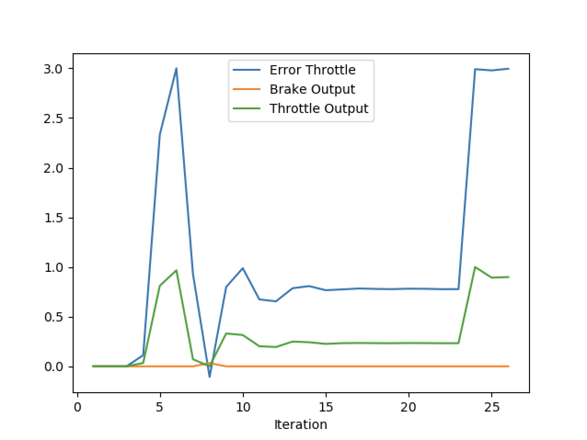

# Project Report
* The included README provides detailed explanation to run the project
* main.cpp, pid_controller.h and pid_controller.cpp include relevant comments explaining each step of the project code that was implemented

## PID Parameter Tuning
Several iterations of PID parameters for steering and throttle were tested to determine the optimal combination that would drive the simulation vehicle along the predefined course and avoid obstacle vehicles. Below are the 10 tests that were ran, and the output plots. Unfortunately, no single combination was found that would avoid the first obstacle vehicle.

| TEST            |          STEER PID          |        THROTTLE PID         |
| :-------------: | :-------------------------: | :-------------------------: |
| TEST 1          | P - 0.4, I - 0, D - 0       | P - 0.3, I - 0, D - 0       |
| TEST 2          | P - 0.7, I - 0, D - 0       | P - 0.3, I - 0, D - 0       |
| TEST 3          | P - 0.7, I - 0.01, D - 0    | P - 0.3, I - 0, D - 0       |
| TEST 4          | P - 0.7, I - 0.1, D - 0     | P - 0.3, I - 0, D - 0       |
| TEST 5          | P - 0.7, I - 0.001, D - 0.1 | P - 0.3, I - 0, D - 0       |
| TEST 6          | P - 0.7, I - 0.1, D - 0.1   | P - 0.6, I - 0, D - 0       |
| TEST 7          | P - 0.7, I - 0.001, D - 0.1 | P - 0.6, I - 0, D - 0       |
| TEST 8          | P - 0.7, I - 0.001, D - 0.1 | P - 0.3, I - 0.1, D - 0     |
| TEST 9          | P - 0.7, I - 0.001, D - 0.1 | P - 0.3, I - 0, D - 0.1     |
| TEST 10         | P - 0.4, I - 0.001, D - 0.1 | P - 0.3, I - 0, D - 0.1     |

## TEST 2

## TEST 4

## TEST 5

## TEST 6

## TEST 7

## TEST 8

## TEST 9

## TEST 10

## What is the effect of the PID according to the plots, how each part of the PID affects the control command?
The proportional term, P, has the largest impact on both steering and throttle as it causes the vehicle to respond proportionately to the output in the opposite direction. Too little of this value and the simulation vehicle will not steer sufficiently or at all, or the vehicle will not move at all off the starting line. Too much of this value and the car will steer drastically out of lane or the car will acceralate agressively off of the starting line. Additionally, there is a balance, especially with throttle, that too much and the throttle will be erratic and unstable (see test 7).

The integral term, I, is intented to counteract bias in the cross-track error (CTE). This componet seemed to have no impact to steering at low values but at slightly higher values it would keep the vehicle more in the center of the lane. For throttle, this term actually seemed to increase the oscillations of the throttle output.

The derivative term, D, is intended to counteract P to reduce overshooting. I noticed that this component would reduce any erratic behavior in steering and throttle, reducing any oscillations that could form.

## How would you design a way to automatically tune the PID parameters?
In my testing, I found that steering and throttle had the tendency to affect each other so a change in steering parameters would also affect the throttle output, this can be seen specifically in tests 6 and 7 where a change in steering caused the throttle to become erratic. Additionally, it was difficult to tune either steering or throttle without having the other at a good setpoint. To mitigate this, I would design two environments - one to tune steering specifically (set the vehicle to a constant velocity) and the other to tune throttle (straight line, with longitudinal markings). Futhermore, twiddle can be implemented to continuously tune the PID controller parameters by analyzing the CTE and keeping track of the smallest CTE through an iterative process to find the minimum.

## PID controller is a model free controller, i.e. it does not use a model of the car. Could you explain the pros and cons of this type of controller?
Being a model free controller, the controller had no knowledge of the vehicle dynamics. This reduced computation time at the cost of an inaccuracies in the ability to predict and control the vehicle. Adding in a physics model of the vehicle would allow the controller to more accurately respond to changes in vehicle dynamics such as suspension for steering and friction for throttle, however this would increase computation time and simulation resources. In a real self-driving car it would be critical to balance these tradeoffs for quick and accurate performance in real-time driving scenarios.

## (Optional) What would you do to improve the PID controller?
As described, it would be extremely beneficial to model the vehicle dynamics appropriately and include some type of automatic and iterative process to the PID tuning, such as tiwddle. I would also isolate the tuning of steering and throttle to at least get each set of parameters to a solid and consistent setting and then work on a combined tuning to achieve the best overall results.
